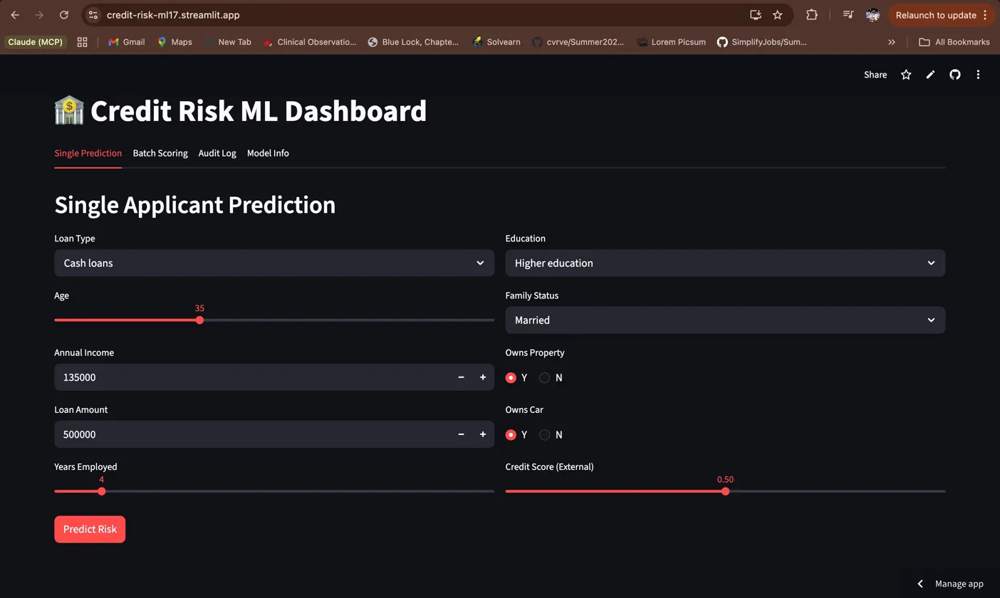
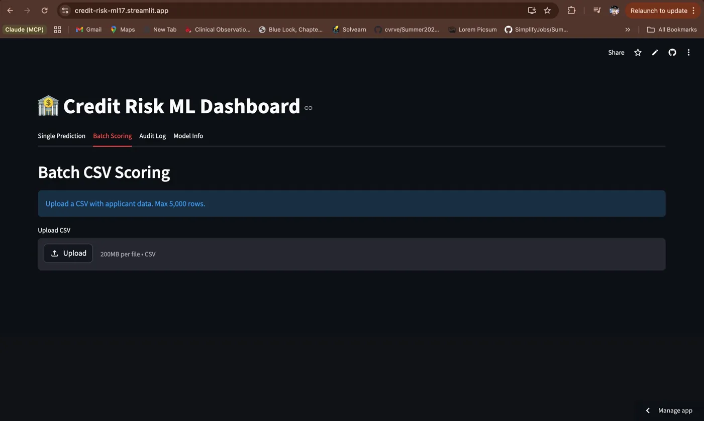
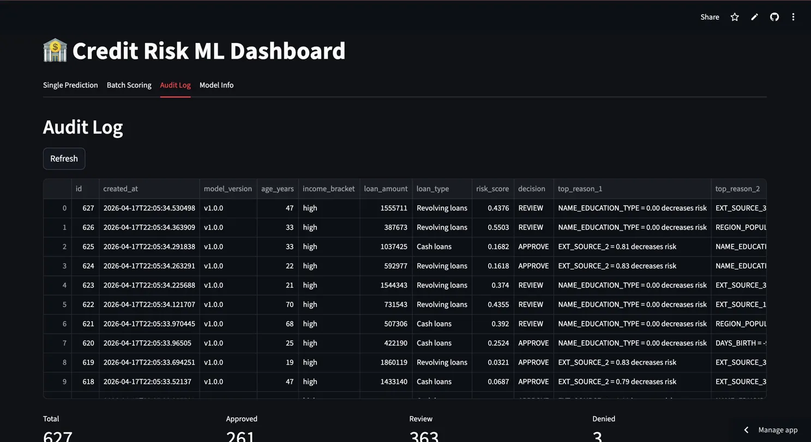
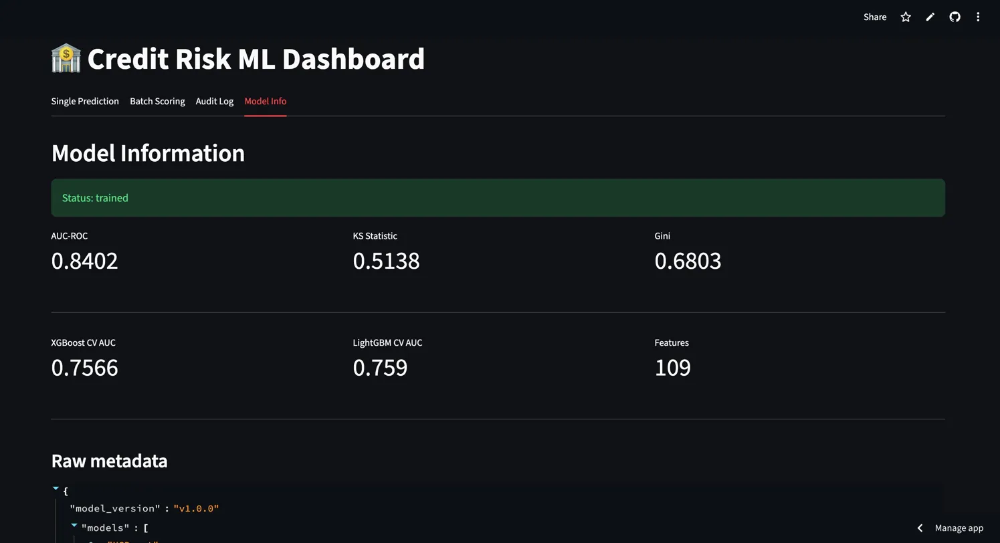

# Credit Risk ML System

A production-grade credit risk prediction API built with XGBoost + LightGBM ensemble, SHAP explainability, and a full audit trail.

## Live Demo
- **API**: https://credit-risk-api-rnzx.onrender.com
- **Dashboard**: https://credit-risk-ml17.streamlit.app/
- **API Docs**: https://credit-risk-api-rnzx.onrender.com/docs

---

## Screenshots

### Single Prediction with Risk Gauge


### Batch CSV Scoring


### Audit Log


### Model Metrics



---

## Model Performance
| Metric | Score |
|--------|-------|
| AUC-ROC | 0.8402 |
| KS Statistic | 0.5138 |
| Gini | 0.6803 |
| XGBoost CV AUC | 0.7566 |
| LightGBM CV AUC | 0.7590 |

---

## System Architecture
- **Training**: XGBoost + LightGBM with 5-fold StratifiedKFold CV
- **Ensemble**: AUC-weighted average (XGB: 49.9%, LGB: 50.1%)
- **Explainability**: TreeSHAP per-prediction top 3 risk factors
- **API**: FastAPI with Pydantic validation
- **Database**: Supabase PostgreSQL audit log
- **Dashboard**: Streamlit with gauge chart, batch scoring, audit log

---

## Dataset
- Home Credit Default Risk (Kaggle)
- 307,511 loan applications × 122 features
- 8.1% default rate — class imbalance handled with scale_pos_weight=11.39

---

## Key Engineering Decisions
- **Feature Store**: Same preprocessing code for training and inference — prevents training-serving skew
- **Class imbalance**: scale_pos_weight=11.39 instead of oversampling — preserves data distribution
- **Ensemble weighting**: AUC-weighted not 50/50 — better model gets more influence
- **SHAP**: TreeExplainer not KernelExplainer — 100x faster for tree models
- **Multi-worker**: 2 uvicorn workers — 25 req/s at 50 concurrent users, 0 failures

---

## Load Test Results
| Users | Avg Latency | Throughput | Failures |
|-------|------------|------------|---------|
| 10 | 203ms | 5.68 req/s | 0% |
| 50 | 219ms | 25.01 req/s | 0% |

---

## API Endpoints
GET  /health          → Service health + DB status
GET  /model/info      → Model metrics and metadata
POST /predict         → Single applicant prediction
POST /predict/batch   → CSV batch scoring (max 5,000 rows)
GET  /audit           → Last 50 predictions
GET  /audit/stats     → Approval/denial statistics

---

## Security
- Pydantic validation on all inputs
- Age range (18-80) and income validation
- Batch size limit (5,000 rows)
- SQL injection safe (Supabase parameterized queries)
- RLS enabled on predictions table

---

## Tech Stack
**ML**: XGBoost · LightGBM · SHAP · scikit-learn · pandas · numpy  
**API**: FastAPI · Pydantic · uvicorn  
**Database**: Supabase (PostgreSQL)  
**Dashboard**: Streamlit · Plotly  
**Deploy**: Render (API) · Streamlit Cloud (dashboard) · Docker  

---

## Local Setup
```bash
git clone https://github.com/Chakrikeerthi9/credit-p3
cd credit-p3
python -m venv venv
source venv/bin/activate
pip install -r requirements.txt
cp .env.example .env  # fill in your Supabase credentials
uvicorn app.main:app --port 8001
streamlit run dashboard/app.py
```
